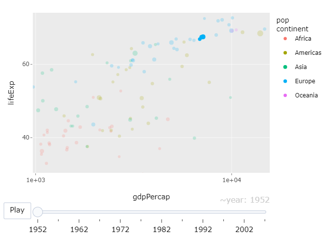

```{r setup, include=FALSE}
knitr::opts_chunk$set(echo = TRUE)
```

---

# 1. RMarkdown basics

## Anscombe's Quartet of 'Identical' Simple Linear Regressions

### Description

Four \(x\)-\(y\) datasets which have the same traditional statistical properties (mean, variance, correlation, regression line, etc.), yet are quite different.

### Usage

```{r results='hide'}
anscombe
```

### Format

A data frame with 11 observations on the following 8 variables.

`x1 == x2 == x3` the integers 4:14, specially arranged

<span style="margin-left: 90px;">`x4` values 8 and 19

`y1, y2, y3, y4` numbers in (3, 12.5) with mean 7.5 and sdev 2.03

### Source

Tufte, Edward R. (1989). *The Visual Display of Quantitative Information*, 13–14. Graphics Press.

### References

Anscombe, Francis J. (1973). Graphs in statistical analysis. *The American Statistician*, **27**, 17–21. [doi:10.2307/2682899](https://doi.org/10.2307/2682899).

### Examples

```{r}
require(stats); 
require(graphics)
require(knitr)
summary(anscombe)
```

now some "magic" to do the 4 regressions in a loop:
```{r, results='asis'}
ff <- y ~ x
mods <- setNames(as.list(1:4), paste0("lm", 1:4))
for(i in 1:4) {
  ff[2:3] <- lapply(paste0(c("y","x"), i), as.name)
  ## or   ff[[2]] <- as.name(paste0("y", i))
  ##      ff[[3]] <- as.name(paste0("x", i))
  mods[[i]] <- lmi <- lm(ff, data = anscombe)
  print(kable(anova(lmi)))
  cat('\n')
}
```

See how close they are (numerically!)
```{r}
sapply(mods, coef)
lapply(mods, function(fm) coef(summary(fm)))
```

Now, do what you should have done in the first place: PLOTS
```{r}
op <- par(mfrow = c(2, 2), mar = 0.1+c(4,4,1,1), oma =  c(0, 0, 2, 0))
for(i in 1:4) {
  ff[2:3] <- lapply(paste0(c("y","x"), i), as.name)
  plot(ff, data = anscombe, col = "red", pch = 21, bg = "orange", cex = 1.2,
       xlim = c(3, 19), ylim = c(3, 13))
  abline(mods[[i]], col = "blue")
}
mtext("Anscombe's 4 Regression data sets", outer = TRUE, cex = 1.5)
par(op)
```

Just for fun, place the “Monstrous Costs” figure from Healy here (either find an image online, or print screen and crop). Make sure to align the figure to center, add a caption, and have the width set to 40%.

```{r, echo=FALSE, out.width="40%", fig.align="center"}

knitr::include_graphics("https://socviz.co/assets/ch-01-holmes-monstrous-only.png")

```

# 2. Analyze the gapminder interactive plot from the introduction.

## Question 2.1
Place here the interactive animated plot from the introduction (you’d need to install and call the libraries `gapminder`, `ggplot2` and `plotly` for it to work). Use the `echo = FALSE` option to hide the code.

```{r echo=FALSE, message=FALSE, warning=FALSE}
library(gapminder)
library(ggplot2)
library(plotly)

gg <-
  ggplot(gapminder, aes(gdpPercap, lifeExp, color = continent)) +
  geom_point(aes(size = pop, frame = year, ids = country)) +
  scale_x_log10() +
  theme(legend.title = element_blank())

ggplotly(gg)

```

## Question 2.2
Without hovering over the markers to show the data that is associated with them, identify a marker that captures your attention (from one of the years). Using the notion of “preattentive search”, try to understand and explain in writing why this particular marker caught your attention. Identify the country that is associated with this marker. Were you surprised? Have you learned something that you didn’t know? Affirmed an intuition? Repeat this exercise, this time with a marker that captures your attention from the animated sequence.

**Static Analysis**: 
A marker captures my attention is the one with the highest GDP per capita in 1952. The marker is located in the middle right corner of the plot, and it is the only marker in that region. The country associated with this marker is Kuwait. I was surprised to see Kuwait as the country with the highest GDP per capita in 1952. I did not know that Kuwait had such a high GDP per capita in 1952. The extremely high GDP per capita of Kuwait in 1952 can be attributed to the discovery and exploitation of its vast oil reserves. Kuwait has one of the largest oil reserves in the world, and the oil industry began to significantly impact its economy in the late 1940s and early 1950s. 

**Animated Sequence Analysis**: 
During the animation, the marker of China showing dramatic improvement in both GDP per capita and life expectancy over time catches my attention. This could represent the country has experienced rapid development and improvement in living standards. Observing such a transformation could highlight the impact of economic development and policy choices on health and well-being.

## Question 2.3
For four of the seven “gestalt rules” of your choice that are enumerated in page 22, provide an example of the principle in practice in the gapminder plot. 

- **Proximity**: Things that are spatially near to one another seem to be related.

<div style="text-align: center;">
  
</div>

- **Closure**: Incomplete shapes are perceived as complete.
<div style="display: flex; justify-content: space-around;">
  
  
</div>

- **Figure and ground**: Visual elements are taken to be either in the foreground or in the background.

<div style="text-align: center;">
  
</div>

- **Common fate**: Elements sharing a direction of movement are perceived as a unit.

<div style="display: flex; justify-content: space-around;">
  
  
</div>


## Question 2.4
Starting to think: one thing we mentioned is that the gapminder plot does not highlight “inequality” very well. Visualizing inequalities entails visualizing distributions. Suggest a tentative method for highlighting aspects of inequality in these data that you find important. You may look online, refer to the diamonds app from the introduction or use any other source. You are not asked to provide any plots here, this is a teaser thought experiment (you may provide examples for visualizations you find relevant). We shall discuss visualization tools for comparing distributions at length throughout the class.

When considering how to visualize inequality in the context of the Gapminder data, we need to think about ways to represent the distribution of these metrics within each country, rather than just providing an average or a single data point per country. We can try applying several following methods that could be employed to highlight aspects of inequality:

**Box-and-Whisker Plots**: These plots show the median, quartiles, and extremes of data, which can highlight disparities within and between countries’ income distributions. Having a box-and-whisker plot for the GDP per capita of each country would show how spread out incomes are around the median.

**Histograms and Density Plots**: These can show the distribution of a single metric, like GDP per capita, across different population segments within a country. They could also be used to compare the distribution of wealth across countries.

**Violin Plots**: These plots combine the features of box plots and density plots, showing the distribution of a metric across different countries.

