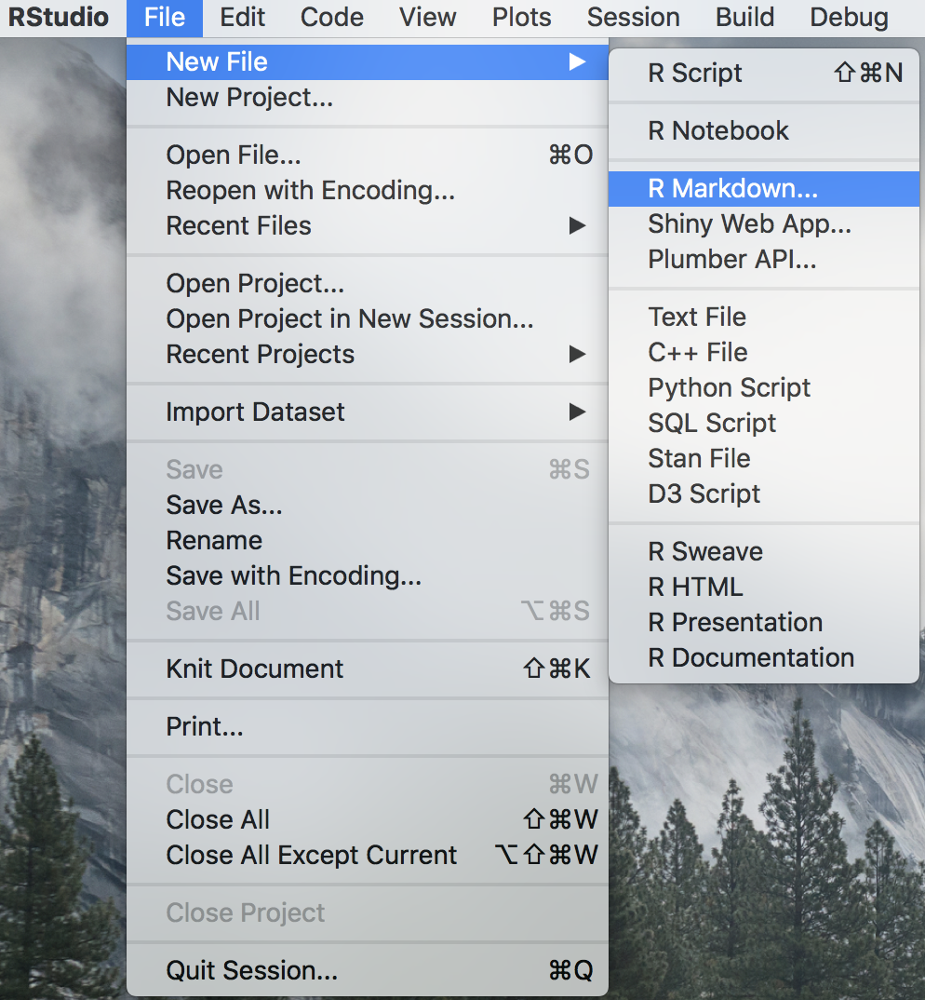
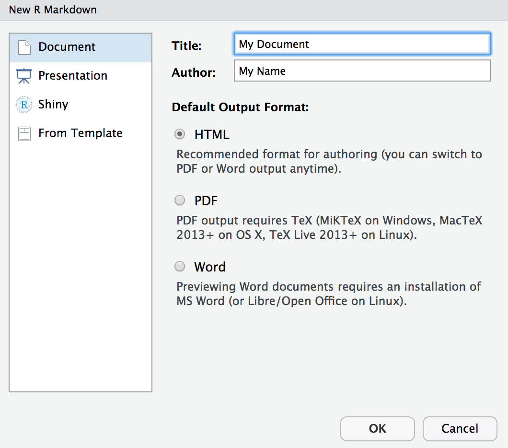
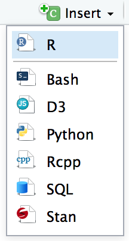
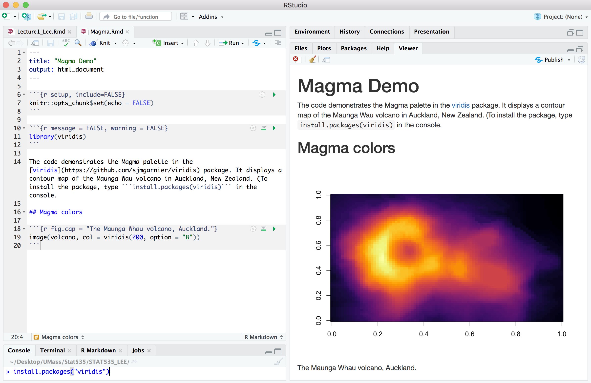

```{r setup, include=FALSE}
knitr::opts_chunk$set(echo = TRUE)
```

---

# R Markdown Basics 
This is an R Markdown document. Markdown is a simple formatting syntax for authoring HTML, PDF, and MS Word documents: (https://vimeo.com/178485416). For more details on using R Markdown see <http://rmarkdown.rstudio.com>.

## Example applications
Now you have learned the very basic concepts of R Markdown. The idea should be simple enough: interweave narratives with code in a document, knit the document to dynamically generate results from the code, and you will get a report. This idea was not invented by R Markdown, but came from an early programming paradigm called “Literate Programming” (Knuth 1984).

Due to the simplicity of Markdown and the powerful R language for data analysis, R Markdown has been widely used in many areas. Before we dive into the technical details, we want to show some examples to give you an idea of its possible applications.

+ Airbnb’s knowledge repository:  
Airbnb uses R Markdown to document all their analyses in R, so they can combine code and data visualizations in a single report (Bion, Chang, and Goodman 2018). Eventually all reports are carefully peer-reviewed and published to a company knowledge repository, so that anyone in the company can easily find analyses relevant to their team. Data scientists are also able to learn as much as they want from previous work or reuse the code written by previous authors, because the full R Markdown source is available in the repository.

+ Homework assignments on RPubs:  
A huge number of homework assignments have been published to the website https://RPubs.com (a free publishing platform provided by RStudio), which shows that R Markdown is easy and convenient enough for students to do their homework assignments. 

+ Personalized email:  
For example, if you want to create personalized handouts for your workshop participants. You can use a template R Markdown file, and knit it in a for-loop to generate 20 PDF files for the 20 participants. Each PDF contained both personalized information and common information. You may read the article https://rmarkdown.rstudio.com/articles_mail_merge.html for the technical details.

+ 2017 Employer Health Benefits Survey:  
The 2017 Employer Health Benefits Survey was designed and analyzed by the Kaiser Family Foundation, NORC at the University of Chicago, and Health Research & Educational Trust. The full PDF report was written in R Markdown (with the bookdown package). It has a unique appearance, which was made possible by heavy customizations in the LaTeX template. This example shows you that if you really care about typesetting, you are free to apply your knowledge about LaTeX to create highly sophisticated reports from R Markdown.

+ Other examples:
  * Journal articles and books
  * Dashboards at eelloo (https://eelloo.nl/groepsrapportages-met-infographics/)
  * Personal websites (ex: https://robjhyndman.com/, https://amber.rbind.io/, https://emitanaka.org/)

## Installation and Complilation
Like the rest of R, R Markdown is free and open source. You can install the R Markdown package from CRAN with:

```install.packages("rmarkdown")```

To start a R Markdown file:

* Open RStudio, go to File -> New File -> R Markdown...
* Select the class of output you would like to generate with your .Rmd file (HTML is the recommended format for authoring a document since you can switch to PDF or Word output anytime. Markdown was originally designed for HTML output, so it may not be surprising that the HTML format has the richest features among all output formats.)

&nbsp;  &rarr;  

* Write your report in plain text. Use markdown syntax to describe how to format text in the final report
* Write a YAML header that explains what type of document to build from your R Markdown file.

* Embed R code into the R Markdown report. When you click the **Knit** button a document will be generated that includes both content as well as the output of any embedded R code chunks within the document. You can embed an R code chunk like this:

```{r cars}
summary(cars)
```

You can also embed plots, for example:
```{r pressure, echo=TRUE}
plot(pressure)
```

```{r Nile, echo=TRUE}
hist(Nile)
```

RStudio creates a **separate R session** to render the document. That background R session cannot interact with any of the environments in the R session you see in RStudio.

Why? Self-containment, Reproducibility!

Note: 
*whenever you knit the Rmd file is automatically saved; the older version of your html ( /pdf / docx) will be overwritten.
* RMarkdown IS sensitive to indentation.

## Markdown syntax

You may also find the following resources helpful:

* The R Markdown Cheatsheet ([link](https://www.rstudio.com/wp-content/uploads/2016/03/rmarkdown-cheatsheet-2.0.pdf))
* The R Markdown Reference Guide ([link](https://www.rstudio.com/wp-content/uploads/2015/03/rmarkdown-reference.pdf))

### Inline formatting
Inline text will be italic if surrounded by underscores or asterisks, e.g., _text_ or ``` *text* ```. Bold text is produced using a pair of double asterisks (``` **text** ```). A pair of tildes (```~```) turn text to a subscript (e.g., ``` H~2~O ``` renders H~2~O). A pair of carets (```^```) produce a superscript (e.g., ```Cu^2+^``` renders Cu^2+^).

To mark text as ```inline code```, use a pair of backticks, e.g., `` `code` ``. To include *n* literal backticks, use at least (*n+1*) backticks outside, e.g., you can use four backticks to preserve three backtick inside: ````` ```` ```code``` ```` `````, which is rendered as ```` ```code``` ````.

Hyperlinks are created using the syntax ```[text](link)```, e.g., ```[RStudio](https://www.rstudio.com).``` The syntax for images is similar: just add an exclamation mark, e.g., ```.``` Footnotes are put inside the square brackets after a caret ```^[]```, e.g.,^[This is a footnote.].

### Block-level element
You can add a table of contents using the ```toc``` option and the section numbers to headers using the ```number_sections``` option:
 
    ---
    title: "Lecture 1: Installation and Basics"
    author: "Instructor: Myself"
    date: "Lecture Date: August 24, 2020"
    output: 
      html_document:
        toc: FALSE
        number_sections: TRUE
    ---

Section headers can be written after a number of pound signs:

    # First-level header 
    ## Second-level header
    ### Third-level header
    
The output is:

# 1 First-level header {-}
## 1.1 Second-level header {-}
### 1.1.1 Third-level header {-}

If you do not want a certain heading to be numbered, you can add ```{-}``` or ```{.unnumbered}``` after the heading, e.g.,

  ```# First-level header without number {-}```

Then the output is:

# First-level header without number {-}

Unordered list items start with ```*```, ```-```, or ```+```, and you can nest one list within another list by indenting the sub-list. If you write:

    - One item  
    - One item   
        + One sub-item  
        + One sub-item

The output is: 

- One item  
- One item   
  + One sub-item  
  + One sub-item
  
Ordered list items start with numbers (you can also nest lists within lists):

    1. First item  
    2. Second item  
        * One sub-item  
        * One sub-item

The correponding output is:

1. First item
2. Second item
    * One sub-item
    * One sub-item

### Math expressions
Inline LaTeX equations (see [Introduction to LaTeX](https://en.wikibooks.org/wiki/LaTeX/Mathematics) can be written in a pair of dollar signs using the LaTeX syntax. For example, ```$f(x) = {n \choose x} p^{x} (1-p)^{n-x}$``` becomes $f(x) = {n \choose x} p^{x} (1-p)^{n-x}$. Math expressions in display style can be written in a pair of two dollar signs. ```$$f(x) = {n \choose x} p^{x} (1-p)^{n-x}$$``` is processed to $$f(x) = {n \choose x} p^{x} (1-p)^{n-x}$$
You can also use math environments inside ```$ $``` or ```$$ $$```, e.g.,

    $$\begin{array}{ccc}
    a_{11} & a_{12} & a_{13}\\
    a_{21} & a_{22} & a_{23}
    \end{array}$$

The output is: 

$$\begin{array}{ccc}
a_{11} & a_{12} & a_{13}\\
a_{21} & a_{22} & a_{23}
\end{array}$$

To write a matrix with brackets:

    $$X = \begin{bmatrix}x_{11} & x_{12}\\
    x_{21} & x_{22}\\
    x_{31} & x_{32}
    \end{bmatrix}$$

The output is:

$$X = \begin{bmatrix}x_{11} & x_{12}\\
x_{21} & x_{22}\\
x_{31} & x_{32}
\end{bmatrix}$$

The matrix determinant of $A=\begin{bmatrix}
a & b \\
c & d 
\end{bmatrix}$ can be written

    $$det(A) = \begin{vmatrix}a & b\\
    c & d
    \end{vmatrix}=ad-bc$$

Then the output is:

$$det(A) = \begin{vmatrix}a & b\\
c & d
\end{vmatrix}=ad-bc$$

## R code chunks and inline R code
You can insert an R code chunk either using the RStudio toolbar (the ```Insert``` button) or the keyboard shortcut ```Ctrl + Alt + I``` (```Cmd + Option + I``` on macOS).

``` {r, out.width='100', fig.align='left', echo=FALSE}
      
```

There are a lot of things you can do in a code chunk: you can produce text output, tables, or graphics. You have fine control over all these output via chunk options, which can be provided inside the curly braces (between ```` ```{r```` and ```}``` in the first line of your R code chunk). For example, you can choose hide text output via the chunk option ```results = 'hide' ```, or set the figure height to 3 inches via ```fig.height = 3```. Chunk options are separated by commas, e.g.,

```` ```{r, chunk-label, results='hide', fig.height=3} ````

The value of a chunk option can be an arbitrary R expression, which makes chunk options extremely flexible. Some of chunk-label are:

+ ```eval```: Whether to evaluate a code chunk.
+ ```echo```: Whether to echo the source code in the output document (someone may not prefer reading your smart source code but only results).
+ ```results```: When set to ``` 'hide' ```, text output will be hidden; when set to ``` 'asis' ```, text output is written “as-is”, e.g., you can write out raw Markdown text from R code (like cat(``` '**Markdown** is cool.\n')```). By default, text output will be wrapped in verbatim elements (typically plain code blocks).
+ ```fig.width``` and ```fig.height```: The (graphical device) size of R plots in inches. R plots in code chunks are first recorded via a graphical device in **knitr**, and then written out to files. You can also specify the two options together in a single chunk option ```fig.dim```, e.g., ```fig.dim = c(6, 4)``` means ```fig.width = 6``` and ```fig.height = 4```.
+ ```out.width``` and ```out.height```: The output size of R plots in the output document. These options may scale images. You can use percentages, e.g., ``` out.width = '80%' ``` means 80% of the page width.
+ ```fig.align```: The alignment of plots. It can be ``` 'left' ```, ``` 'center' ```, or ``` 'right' ```.\
+ ```fig.cap```: The figure caption.

In the following example, the R Markdown file below contains three code chunks:



If you want to include a graphic that is not generated from R code, you may use the ```knitr::include_graphics()``` function, which gives you more control over the attributes of the image than the Markdown syntax of ``````. 

<block>
      ```` ``` {r, out.width='30%', fig.align='center', fig.cap='Fresh Fruits', echo=TRUE} ````  
      &nbsp; &nbsp; &nbsp; &nbsp; ```knitr::include_graphics('Lecture0_fruits.png') ```  
      ```` ``` ````
</block>

``` {r, out.width='30%', fig.align='center', fig.cap='Fresh Fruits', echo=TRUE}
      
```

To place multiple figures side-by-side from the same code chunk, you can use the ```fig.show='hold'``` option along with the ```out.width='50%'``` option:

```{r,echo=FALSE, fig.show='hold', out.width='50%'}
plot(pressure,main="Pressure")
hist(Nile)
```

To add a table, you can use the ```kable()``` function from the **knitr** package to format tables that integrate well with the rest of the Tufte handout style. The table captions are placed in the margin like figures in the HTML output.

```{r}
knitr::kable(
  mtcars[1:6, 1:6], caption = 'A subset of mtcars:'
)
```
